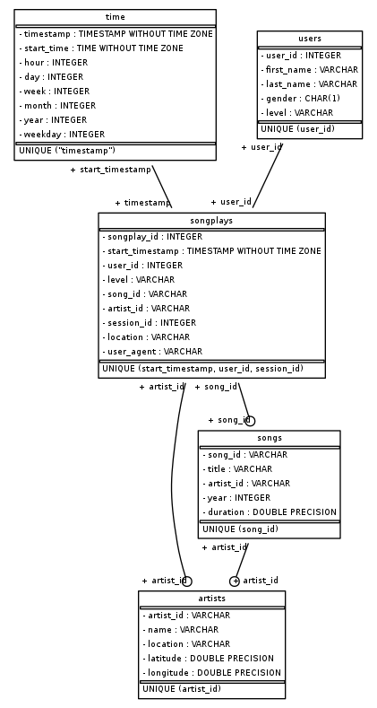

# Udacity - Data Engineering Nano Degree

## Project 1: Data Modelling with PostgreSQL

### Table of contents

* [Project Description](#project-description)
* [Files in Repository](#files-in-repository)
* [Setup](#setup)
* [Schema](#schema)
    *   [Dimensional Tables](#dimensional-tables)
    *   [Fact Table](#fact-table)
    *   [Entity Relationship Diagram (ERD)](#erd)
* [ETL Processes and Pipeline](#etl)
* [Example Queries](#example-queries)

### Project Description
In this project, a Postgres database is created to query songs and user
activity data from a new music streaming application developed by a
startup company called Sparkify. The main goal of this project are to
enable database queries hence allow analytics team to analyse the
collected data and gain insights on users' music preferences in
particular. The collected songs metadata and user activity logs are
available in JSON file format. The data will be divided into **one fact
table**, that contains a number primary keys and is where the data for
song play queries from, and **four dimension tables** (namely artists,
songs, users, and time) which primary keys are referred to in the fact
table as foreign keys. With one fact table and four dimension tables,
the database will be structured in a star schema.

The ETL processes and pipeline will be built to transfer data from files
in two local directories into these tables in Postgres using Python and
SQL.

### Files in Repository
In addition to the data and images files in folders, there are six other
files in the repository:

* `test.ipynb` displays the first few rows and other queries results of each table
    to check whether the data insertion into the database. This notebook
    needs to be restarted by clicking *Restart Kernel...* button on
    *Kernel* menu to close the connection to `sparkifydb` database.
* `create_tables.py` drops and creates tables. This file is run to reset the database
    before each run of the ETL scripts.
* `etl.ipynb` shows the detailed ETL process where a single file from `song_data`
    and `log_data` are extracted and transformed before data loading into each of the
    tables.
* `etl.py` contains ETL pipeline where the ETL process developed in the notebook above is
    looped through all files in both `song_data` and `log_data`.
    It reads and processes files from `song_data` and `log_data` and loads
    them into each tables.
* `sql_queries.py` contains all the SQL queries, and is imported into the last three
    files above.
* `README.md` provides discussion on this project.

### Setup
To run the ETL pipeline in this project, close database connection in
both
`test.ipynb` and `etl.ipynb` notebooks (if they have been previously run), then type the two
following commands in the Project Workspace Terminal consecutively:  
`$ python create_tables.py`  
`$ python etl.py`

### Schema
The star schema for queries on song play analysis consists of the
following tables. The number on the table name shows the order of table
creation in ETL pipeline.

#### Dimension Tables

1.  **artists** - artists in music database
  * _artist_id, name, location, latitude, longitude_

2.  **songs** - songs in music database
  * _song_id, title, artist_id, year, duration_

3.  **users** - users in the app
  *   _user_id, first_name, last_name, gender, level_

4.  **time** - timestamps of records in songplays broken down into specific units
  *   _timestamp, start_time, hour, day, week, month, year, weekday_

#### Fact Table

5.  **songplays** - records in log data associated with song plays i.e. records with page
    `NextSong`.
  *   _songplay_id, start_timestamp, user_id, level, song_id, artist_id, session_id, location, user_agent_

#### Entity Relationship Diagram (ERD)
Entity Relationship Diagram (ERD) of this star schema is shown below. 

### ETL Processes and Pipeline
After getting list of song and log JSON files from its corresponding directory and storing them in
`song_data` and `log_data` respectively, the ETL process and pipeline are broken down into two steps:

1.  **ETL Process on `song_data`** 
    As each song JSON file only contains metadata of one song, the song
    and artist data are processed and inserted one row at a time into
    `songs` and `artists` tables, respectively.

2.  **ETL Process on `log_data`** 
    Each of the log JSON file contains multiple logs of users activity on the music app on the day, and they are inserted into
    the `time`, `users`,  and `songplays` tables in batch using `execute_batch()` method from `psycopg2.extras` module.
    Before data insertion, the `ts` column in log files that contains timestamp in unix epoch format in miliseconds precision,
    is converted to datetime in datetime64[s] dtype.

### Example queries

Below are screenshots of some of the SQL queries: 
***Number of uniques values in each tables*** 

***Artists table*** 

***Songs table*** 

***Users table*** 

***Time table*** 

